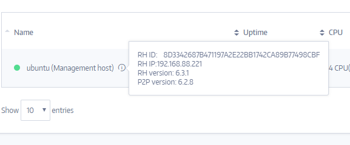
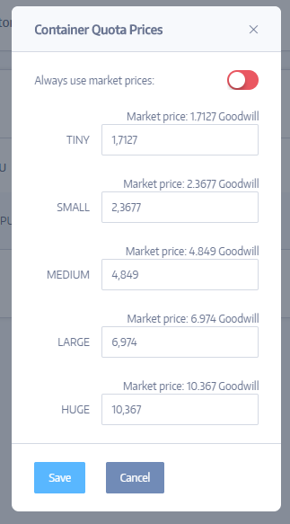

A Peer is a single Subutai node with management services (a management
host container), and at least one local Resource Host (1 - N RHs) that
contribute resources to be shared.

List of Peers
-------------

On this page user can see the list of all online and offline existing
Peers. The following information about Peers is available:

1.  Peer’s name.

2.  Price of using the Peer (per hour, in GoodWill).

3.  Information about CPU: quantity and type of cores, frequency of the
    processor, manufacturer of processor.

4.  Information about RAM (random access memory) in GB (Gigabyte)

5.  Information about volume of hard disk in GB.

6.  Country where the Peer is located.

7.  Internet service provider (ISP).

8.  Rating of Peer.

9.  Status of Peer. Here the user can add the Peer to their list of
    > Favorite Peers, which can be used to create Environments later.
    > Here you can also remove Peers from your favorite Peers list.

Also, you can sort Peers using the options on the top. And you can click
“My Peers” button to see all the Peers you own

Individual Peer page
--------------------

On the individual Peer page you can see a lot of useful information:

1.  Username of the Peer’s owner.

2.  Location of the Peer.

3.  Last heartbeat. This is the last ping (test reachability of host)
    > from the Peer, which shows that the Peer is online.

4.  Name of the Peer’s internet provider.

5.  Scope. Peer can be public (visible for everyone) or Private (visible
    > only for its owner).

6.  You can see this Peer in the War room, by clicking this button:
    > 

7.  To open Subutai console you can use this button:
    > 

8.  On the top right corner you can add or remove to/from your favorite
    > list of peers:

On this page there is also information about the Resource Host (server
that provides premise for container):

1.  Name of Resource Host, here also available peers information:

-   Resource Host ID (RH ID)

-   IP address of Resource Host (RH IP)

-   Resource Host version (RH version)

-   P2P version

2. Uptime in %. This is total % of time this Peer is online.

3. CPU. Information about Peer’s processor characteristics:
Manufacturer, core frequency, amount of cores.

4. RAM. (Random Access Memory) shows the Peers’ total memory in GB.

5. HDD (Hard disk drive) shows Peer’s total Hard Disk space available in
GB.

6. Price. Usage of Peers can be paid. This field shows the price for per
hour of using the Peer. Price depends on the size of containers.

7. If you have your own Peer, you can set up its prices by clicking
“Action” button:

Also clicking the “Action” button you will be able to see metrics of
your peer. These are statistic that can be shown by chosen parameters
like: last 1 hour, 6 hours, day, week, month…

If you are the owner of the Peer you can also see an overview of peer:
error logs, current environments on this peer, history.
