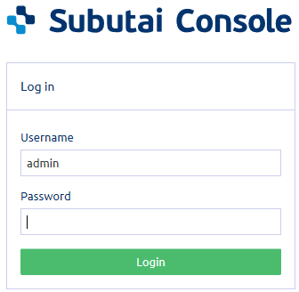

During peer creation, the modules of the Management software and its Console are installed and set up. At the end of peer creation, the default Console details are displayed: Console IP address and port number, username, and password. For sample details, see the last section of Basic setup using Vagrant with VirtualBox.

Here are several ways to access the Console:

* **From a browser**

  On the address bar of a browser, enter the Console’s IP address and port number. This URL, including default Console credentials, is provided upon peer creation. For more information, see Access and manage peers through the Management Console.	

* **From Bazaar**

  ❗️ This option is available only for peers registered with Bazaar and if the Tunnel feature is enabled for the peer. For more information, see Setting Up Peers in Bazaar.

  From the Tools menu, go to Peers. On the Peers page, select the peer that you want to access to open its details page. On this page, click the Open Subutai Console icon to log in to the Console.

  💡 If you want to access a shared peer, click My Peers and then go to the Shared peers tab. 
  
  

* **From Control Center**

  From the menu, go to Peers and then select the peer that you want to access. On the Peer page, click **Open Console** to access the Login page.

Regardless of how you access Console, you are redirected to its Login page.

After your initial login to a peer’s Console, you are prompted to replace the password and assign your own.

