From the menu, go to Environment > Environments to create, update, and manage environments.
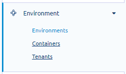

The Environment page consists of the following panels and tools:
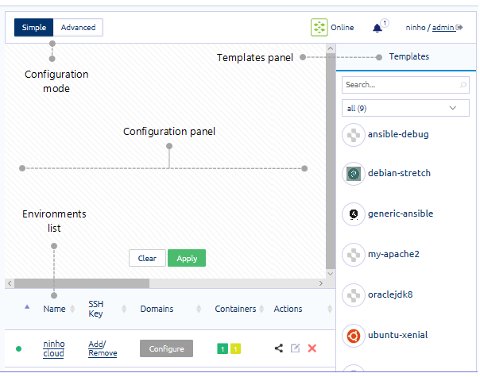

View the instructions and guidelines on using these features to perform the following tasks:
* [Create environments](#create-environments)
* [Set up environments](#setup-environments)
* [Configure domains](#configure-domains)

###  Create environments
Follow these instructions to create an environment via the Simple mode. It creates an environment based on a template of your choice within a container that you can set up.
 
To create environments:

1. At the top of the page, click **Simple**.

2. From the Templates panel, click a template to select it.   

   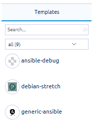

   This adds a container with default settings (i.e., Tiny size). 

   To search for a template, do any of the following:
   * Use the Search box - Enter the full or partial name of the template. As you enter a character, the list is narrowed down.
   * Select a filter: All or Own
	
3. On the container, click **+** to replace the default settings.   
   This opens the container Settings box.

4. On the Settings box, enter a unique hostname and select the quota size.
       
   💡 Refer to the container size details to the right of the fields to help with your selection.

   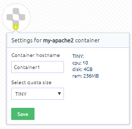

5. Click **Save**.
  
   💡 If you want to add another template, repeat steps 3-5.  

6. After you have set up the containers, click **Apply**.

7. On the Build Environment box, enter a unique environment name and review the containers or templates to be added.
	
   If you want to update or remove a container, click **X** to exit. To update container details, repeat steps 3-7. To remove a container, click **X** on the container holder.

8. Click **Build**.
 
   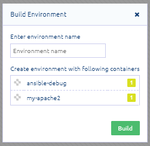

Take note that creation of environments might take a few minutes to complete, based on the size and contents of a template. You can monitor the build on the progress box. 

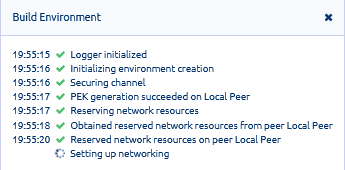

At the end of processing, you are notified that the environment has been created. The new environment is added to the Environments list. 

###  Set up environments
After creating an environment, you can add applications to containers and set up domains. You can view all environments on the peer, including those created through Bazaar by your tenants, for instance. However, you cannot manage or perform certain tasks on these environments. 

To set up environments:

1. From the menu, go to Environment > Environments. 

2. On the Environments list, you can perform the following tasks on an environment:   

* **View the number of containers and other details**   
  Containers are numbered in order of creation and colored based on size. Hover over a container to display the template name and container size.   
  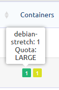
  
* **Share environments**   
  In the Actions column, click the share icon. On the Share Environment box, click **+** next to the user.   
  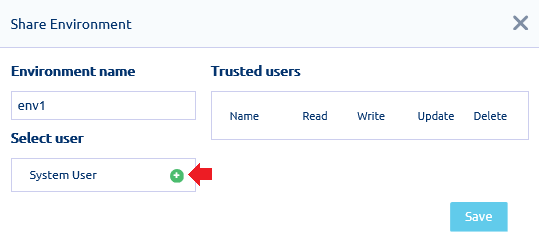   
  Your selected user is added to the Trusted users list. On the Trusted users section, check the box for the permissions you want to assign to the user. Click **Save**.   
     
  💡 Click **X** if you want to remove the user from the Trusted users list.     

* **Destroy environments**    
  In the Actions column, click **X** next to the environment you want to destroy. Take note that the process cannot be reversed: all contents and settings are deleted. Confirm that you want continue.    
   
  You can perform these tasks only on environments created through the Console. Those created through Bazaar can be updated only through Bazaar.  

* **Add/Remove SSH key**   
  Click the Add or Remove link accordingly.    
    * To deploy an SSH key to the environment, enter or upload the SSH key file, and then click **Save**.    
    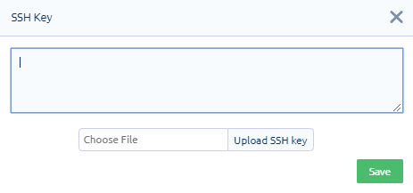
    * To remove a deployed SSH key from an environment, click **X** next to the key that you want to delete.   
    
* **[Configure domains](#configure-domains)**
   
* **Edit container size**
   In the Actions column, click the edit icon. Click **+** on the container that you want edit to display the Settings box. From the list, select the new size of the container.
   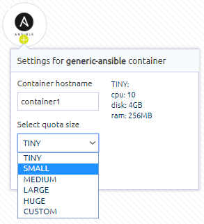

   ❗️ Don’t forget to save and apply your changes. 

####  Configure domains
Domain configuration is a two-step process. You have to add a domain to the environment, and then assign it to one or more containers within the same environment. 

❗️ Before configuring domains, be sure that the environment is healthy and running. 

To configure domains:

1. Add a domain to your environment.    
   a. From the menu, go to Environment > Environments.   
   b. On the Environments list, click **Configure** for the environment where you want to add the domain.    
   c. On the Set Domain box, enter a unique domain name.   
      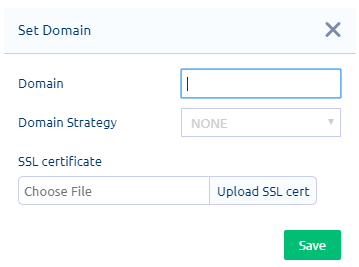
   d. Optionally, you can select a strategy (i.e., Round robin, Load balance, Sticky session) and upload the SSL certificate.   		
   e. Click **Save**.   
      A confirmation message is displayed once the domain has been successfully added to the environment.
 	
2. Assign the domain to a container.
   a. Click the environment name to display its containers.
   b. Click **Configure** for the container where you want to assign the domain. 
   c. On the Domain box, check the box for Add domain to container, and then enter the port number.
      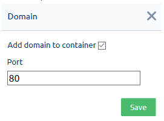
   d. Click **Save**.

On the Environments list, you can also perform other domain tasks:

* **Update a domain**  
Click Configure for the environment’s domain. On the Domain box, you can set or update the strategy or SSL certificate for the domain. 

* **Delete a domain**   
If you want to replace a domain, you have to delete the existing one first, and then add the new one to the environment. To do so, click Configure for the environment where the domain is added to. The current domain name is displayed at the top of the Domain box. Click Remove Domain and then confirm that you want to delete it. 

📝 Note |Deleting a domain from the environment also removes it from the associated container.

Remove domain from container
Click the environment name to display its containers. Click Configure for the container associated with the domain you want to remove. On the Domain box, uncheck the Add domain to container box, and then click Save. 
