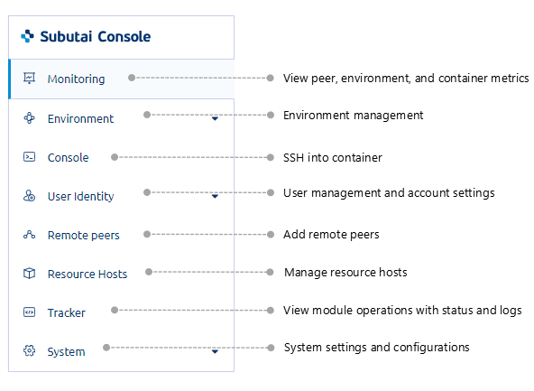
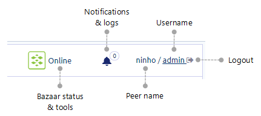

# Using the Management Console

Find out how to use the features of the Management Console, from monitoring to maintenance of peers, environments, and containers. 

### Overview

#### What is it?

The Subutai Management Console is an online application used primarily for peer operation and maintenance. Through the Console, you can also set up and manage other resources that compose your cloud environment.

#### Key features

With the Management Console, you can perform the following tasks online:

* Monitor peer and container performance through various metrics
* Register peers with Bazaar
* Verify the current state or health of your peers
* Create and monitor peer environments and their containers
* Modify resource host parameters
* Deploy applications and plugins on environments
* Use Karaf containers

#### How it works

Each Subutai peer is installed automatically with the Management Software and Console, upon creation. Through the Console, you can use the online tools of the Management Software, which allow you to access peers and perform maintenance tasks on their environments and containers. Take note that for environments created by other users, like your peer renters for instance, you only have viewing access to their general data: environment and container name, resource usage, etc. In the same manner and through additional security features, you are protected from online risks and unauthorized access to your resources.
   
### Access

During peer creation, the modules of the Management software and its Console are installed and set up. At the end of peer creation, the default Console details are displayed: Console IP address and port number, username, and password. For sample details, see the last section of [Basic setup using Vagrant with VirtualBox](../../working-with-subutai/using-peeros/peeros-quick-install/virtualbox).

Here are several ways to access the Console:

* **From a browser**   
On the address bar of a browser, enter the Console’s IP address and port number. This URL, including default Console credentials, is provided upon peer creation. For more information, see [Access and manage peers through the Management Console](../../working-with-subutai/using-peeros/manage-peers).

* **From Bazaar**   
:heavy_exclamation_mark: This option is available only for peers registered with Bazaar and if the Tunnel feature is enabled for the peer. For more information, see [Setting Up Peers in Bazaar](../../working-with-subutai/using-bazaar/bazaar-tools).

From the Tools menu, go to Peers. On the Peers page, select the peer that you want to access to open its details page. On this page, click the Open Subutai Console icon to log in to the Console.

 !! If you want to access a shared peer, click My Peers and then go to the Shared peers tab.

* **From Control Center**    
From the menu, go to Peers and then select the peer that you want to access. On the Peer page, click **Open Console** to access the Login page.
	
Regardless of how you access the Console, you are redirected to its Login page.

 

After your initial login to a peer’s Console, you are prompted to replace the password and assign your own.

### Know

Get to know the features and tools that you can access from each menu option in the Management Console.

#### Console menu

Click a menu option to display the page or the submenu indicated by the down arrow.

#### Console tools

At the top right corner of the main page are the following account tools and details:

* **Bazaar status and tools**    
Additional tools are provided specifically for peers registered with Bazaar. 

Beside the Bazaar logo, you can see the current status of a registered peer: Online or Offline. Click the Bazaar status or logo to display the submenu.

> screenshot 1

  * **Go to Bazaar** - Redirects you to the Bazaar site.
  * **Send Heartbeat** - Manually sends a heartbeat from your peer to Bazaar to verify that your peer is up and running. A confirmation message is displayed to notify you of the successful transmission.
  * **Register/Unregister** - Opens the Peer Registration form or unregisters the peer from Bazaar.

* **Notifications and logs**    
  The Notification bell with a number indicates the presence of notifications or logs. These notify you of available updates, task status, and change in Console settings or components.
  
!! If you want to view log details, go to System > Updates.

 Click the bell to display the list of notifications.

> screenshot 2

  A few notes about managing notifications:
  * For notifications that provide options or controls, like the image above, you may choose your preferred action as necessary. 
  * A maximum of ten notifications at a time are displayed in the list.
  * Click **Clear** to remove all displayed notifications.

