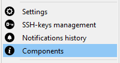

Additional components include third-party applications and plugins for managing PGP keys, creating peers, enabling remote access, and joining the p2p swarm. From the Components screen, you can install the components that you need depending on your system or setup:

<table>
 <tr>
   <td> <a href="https://subutai.io/getting-started.html#Control-Center">Subutai Control Center</a>
   </td>
   <td> For Control Center updates
   </td>
 </tr>
 <tr>
   <td> <a href="https://subutai.io/getting-started.html#P2P">Subutai P2P</a> 
   </td>
   <td> Handles  the connection between peers and environments
   </td>
 </tr>
 <tr>
   <td> <a href="https://www.vagrantup.com/intro/index.html">Vagrant</a> 
   </td>
   <td> Helps you build and manage virtual machine environments on various hypervisors
   </td>
 </tr>
 <tr>
   <td> <a href="../e2e-plugin">Subutai E2E</a> 
   </td>
   <td> Generates and manages PGP keys. 
   </td>
 </tr>
 <tr>
   <td> <a href="https://www.virtualbox.org/wiki/VirtualBox ">Oracle VirtualBox</a> 
   </td>
   <td> Used as the default hypervisor  
You can check the other supported hypervisors here.
   </td>
 </tr>
 <tr>
   <td> Google Chrome
   </td>
   <td> Used as the default browser  
Firefox, Safari, and Edge browsers are also supported.
   </td>
 </tr>
 <tr>
   <td> <a href="https://app.vagrantup.com/subutai/boxes/stretch">Vagrant Subutai box</a>
   </td>
   <td> Serves as the resource box for peer creation
   </td>
 </tr>
 <tr>
   <td> <a href="https://github.com/subutai-io/vagrant">Vagrant Subutai plugin</a>
   </td>
   <td> Sets up peer parameters, like disk size and RAM
   </td>
 </tr>
 <tr>
   <td> <a href="https://www.vagrantup.com/docs/virtualbox/">Vagrant VBGuest plugin</a>
   </td>
   <td> Sets VirtualBox as your hypervisor for Vagrant
   </td>
 </tr>
 <tr>
   <td> <a href="https://wiki.x2go.org/doku.php/doc:usage:x2goclient/">X2Go Client</a>
   </td>
   <td> Enables remote desktop access  
    💡 For macOS, be sure that XQuartz is installed first.
   </td>
 </tr>
 </table>

On the second column, you can check the current version of software installed on your system and update them as necessary.

To install or update software components: 
1. From the menu, go to Components.   
 
2. On the Components screen, click **Install** for the corresponding component that you want to download.   

   💡 If you are going to install all components, you can follow the order of the components as listed. You will not be able to successfully install components with dependencies on software listed above them. For example, you must install VirtualBox before the VirtualBox plugin. 

   Installed components will show the **Update** button, which is enabled automatically when an update becomes available.   

   ✔️ The Control Center checks for updates each time you open the Components screen for the first time. If you want to do a manual check right away, click **Check for updates**. If you want to specify the frequency of checking for updates, refer to the Updating section under [Configure Control Center Settings](../../control-center/configure-settings).

   You can monitor the installation through the progress bar of the component.    
   

#### Handling errors or failures
In case you encounter an error, go to Notifications history to review the details. If you need to retry an installation, go back to the Components screen.   

💡 You may install third-party applications manually by going to their official download centers or sites. For Subutai applications, you may install them manually through the links in the table or from their [GitHub](https://github.com/subutai-io) repositories.
 
#### Uninstall components
To uninstall, check the box for each component, and then click **Uninstall components** located at the bottom of the screen. For certain software such as Vagrant, it is best to uninstall its dependent components first.

