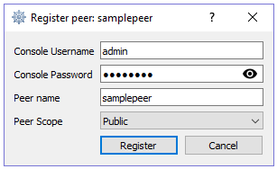

On the My Peers screen, you can access peers associated with the logged in Bazaar account. To view and manage peers, go to My Peers from the menu, and then click the name of the peer that you want to access. You can view the details of a peer such as the connected environments, and use the tools for registering, starting, and reloading a peer. 

* **Access peer in Bazaar and Console**   
Gain access to peers in the Subutai Bazaar and Console applications. Click the appropriate button located at the top of the screen.     
   
  * **Open peer in Bazaar** - View details of a registered peer in Bazaar, on the My Peers page. This button is enabled only when your peer is registered with Bazaar.
  * **Open Subutai Console** - You can also launch the Console for advanced management of a peer, its environments, and containers. 

* **Update SSH settings**   
In the SSH Info section, check the **Modify SSH info** box to update the host and SSH ports, as well as the username and password credentials. Uncheck the box, once done, to save the new settings. Check if the settings work by clicking **SSH into peer**.   

* **Update peer settings**   
  In the Peer Info section, check the **Modify peer info** box, and then adjust or change the settings for the bridge interface, disk space, RAM, and CPU. Uncheck the box, once done, to save the new settings.  Click **Reload peer** to apply the changes.   

  💡 You can only add more disk space to the peer. The current Max disk GB setting of a peer cannot be decreased.

  

* **Use peer controls**   
At the bottom of the screen are options to change the peer state from running to not running, destroy, or reload it.    
   
  * **Start or Stop peer** - Click to set the state to running or not running, respectively.
  * **Destroy peer** - Click to terminate the peer and remove it from the Control Center. This removes all environments associated with the peer.
  * **Reload peer** - Click to restart or update a peer, in case you have made any changes or upgrades. This will stop a running peer before beginning the reload, and then restart it after.
  * **Update is available** - Click to apply updates received by the Control Center. If there are no updates, this button is disabled and is renamed to **No updates available**.

* **Register peer with Bazaar**   
  To make peers available to users of Bazaar, click **Register peer to Bazaar**. Verify that the peer is set up and running before submitting your registration.

  💡 The **Register** button is renamed to **Unregistered** once your peer has been successfully registered with Bazaar. Another way to unregister is through the Delete option on the Peers page in Bazaar. 

  On the Register Peer form, enter the following details: Console username and password; name of the peer that you want to register; and, scope of peer use or exposure.
  
  

  After registering your peers, they are added to the Peer list in Bazaar where other users can select them to set up environments. Peers that are set to Private scope are not displayed in the list.

For more details about the Peers page, refer to the Peers section under [Get to Know the Control Center](../../control-center/get-to-know).
