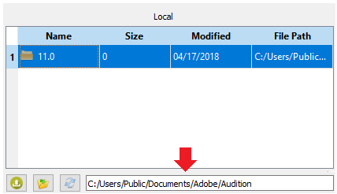

Access environments and their containers to perform operations remotely or through a desktop application such as X2Go. You can access only the environments associated with the logged in Bazaar account. 

#### How to deploy SSH keys to environments
For authentication, you need to deploy an SSH key to the environment first before establishing a connection. 

To deploy SSH keys to environments:

❗️ This operation updates the environment and places it on Under Modification state during processing.

1. From the menu, go to SSH-keys management. 
2. On the SSH Key Manager screen, select the key that you want to deploy from the Existing Keys list.   

   💡 Click **Generate New Key Pair** to add a key if you don’t have any or want to have one for specific purposes. 

3. From the Healthy Environments list, check the box for the environment where you want the key to be deployed.

4. Click **Deploy Key**.   

   💡 Keys that you deploy to an environment are also listed on the Environments page in Bazaar, under the SSH Keys tab.

#### How to establish container connection
After deploying an SSH key to your environment, you can now access the container to perform your tasks. If you are using remote desktop, be sure that you also have installed and set up the X2Go client. For instructions, see Install or Update Software Components.

To access and manage containers within an environment:

1. From the menu, go to Environments, and then click the name of the environment associated with the container. 

2. On the Environment screen, you will see the list of containers. Take note of the environment’s status displayed beside its name and the container’s status as well. To access them, the environment should be “Healthy” and the container should be “Ready”.  

3. Check the box for the container, and then click the button that corresponds to the task that you want to perform: 
  
   💡 If you have multiple containers and you want to access them all, check the **Select All** box. 
    * **SSH** - Access the container via a CLI to perform updates or maintenance tasks.
    * **Remote Desktop** - For desktop environments, access the container via a remote desktop.   
    

#### How to transfer files to or from containers

After deploying an SSH key to your environment, you can transfer files from your local machine to a remote one, or vice versa.

1. On the Transfer File screen, double-click the folders on the Local or Remote directory until you reach the files to be transferred.   
   As you click on folders, the path field is updated.   
   

2. Double-click the files to select and add them to the Source file table located below the directories. 
  
   ✔️ To remove files from the table, click to select the file, and then click **Clear files**.
   

3. To transfer files, do either of the following:
   
   **Single file transfers**   
   Use the controls for the Local or Remote directory to perform the following:
   * **Upload** - Click the upward arrow to start uploading files from the local to the remote folder.   
     ✔️ Before initiating a transfer, you can check the **More info** box to display the SSH and remote machine parameters.
  
   * **Download** - Click the downward arrow to start downloading files from the remote to the local folder.
   Check the progress in the Operation Status column.
 
   **Bulk transfers**
   * To manage the order of the queue, drag and drop a file above or below another file. 
   * Click **Start to Transfer Files** to begin the transfer. 

4. Use the following controls for the folders and files:
   * **Go to parent directory** - Click the folder icon to return to a previous directory. 
   * **Refresh directory** - Click refresh icon to refresh the directory folders and files. Once a transfer has been successfully completed, you can refresh the folder to see the transferred file.
